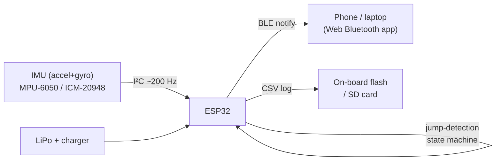

# Jump Height 🪂🌊

**An open-source, open-hardware jump tracker for wing foiling** — a DIY alternative
to the [Woo](https://www.woosports.com/). Stick a small waterproof sensor on the
board, go send it, and find out **how high you jumped** and **how long you were in
the air**.

> Status: **v1 ready to assemble.** Building it is wires-and-glue only — every
> software step is one command via `./tools/jump` (flash, wiring self-test, guided
> desk test, drop-test calibration, session download + report), and the whole flow
> can be **rehearsed with zero hardware** against a simulated device. Start with
> **[BUILD.md](BUILD.md)** (the runbook) and **[DECISIONS.md](DECISIONS.md)** (what
> was chosen and why).
>
> ```bash
> ./tools/jump wizard           # plug in and follow along: setup → flash →
>                               # wiring check → desk test → calibration
> ./tools/jump wizard --fake    # rehearse the exact same flow today, no hardware
> ./tools/jump report           # stuck? one file with everything Claude needs
>                               # to troubleshoot remotely (logs, config, self-test)
> ```

---

## The one idea that makes this work

You might expect to measure height by integrating acceleration twice (accel →
velocity → position). **Don't.** Tiny sensor errors accumulate into meters of
drift within seconds. Every commercial device (Woo, Surfr, Sherpa) sidesteps this
with the **airtime method**:

1. When the board leaves the water, it's a projectile in **free-fall** — an
   accelerometer riding on it reads **~0 g**.
2. When it lands, there's a **sharp acceleration spike** (several g).
3. The time between takeoff and landing is the **airtime `T`**.
4. Because a jump off flat water is a symmetric parabola, height follows directly:

```
        g · T²
   h =  ------            (g = 9.81 m/s²)
          8
```

| Airtime `T` | Jump height `h` |
|------------:|----------------:|
| 0.5 s       | 0.31 m (1.0 ft) |
| 1.0 s       | 1.23 m (4.0 ft) |
| 1.5 s       | 2.76 m (9.1 ft) |
| 2.0 s       | 4.90 m (16 ft)  |

So the whole problem reduces to **reliably detecting the takeoff and landing
instants** in a noisy accelerometer signal. That's a solvable signal-processing
problem — and it's what the code in this repo does.

See [`docs/algorithm.md`](docs/algorithm.md) for the full derivation, assumptions,
and edge cases.

---

## Architecture



The same detection algorithm runs in two places, kept intentionally in sync:

- **[`firmware/`](firmware/)** — C++ for the ESP32 (`jump_detector.h`), runs on the
  board in real time.
- **[`sim/`](sim/)** — a pure-Python mirror (`detector.py`) plus a synthetic-data
  generator, so you can develop and tune the algorithm **without hardware** and
  replay real captured sessions offline.

---

## Repo layout

```
Jump-height/
├── README.md            ← you are here
├── BUILD.md             ← the hardware-day runbook + shopping list (start here to build)
├── DECISIONS.md         ← the v1 design decisions and why
├── config/params.json   ← ALL tunable settings — one file feeds firmware + sim + analysis
├── tools/
│   ├── jump             ← the one-command interface: setup/flash/selftest/desktest/drop/sync/simtest
│   ├── fake_device.py   ← simulated device (rehearse + test everything with no hardware)
│   └── gen_params.py    ← bakes config/params.json into a firmware header
├── docs/
│   ├── algorithm.md     ← the physics + detection state machine, in detail
│   ├── hardware.md      ← bill of materials, wiring, power, waterproofing
│   └── roadmap.md       ← phased build plan (bench → firmware → water → app)
├── firmware/            ← ESP32 firmware (PlatformIO)
│   ├── platformio.ini
│   ├── include/jump_detector.h   ← portable detection state machine
│   └── src/main.cpp              ← read IMU, run detector, log + BLE
├── sim/                 ← develop & test the algorithm with no hardware
│   ├── detector.py      ← Python mirror of the firmware detector
│   ├── generate.py      ← synthesize IMU sessions with known jumps
│   └── run.py           ← run detector on synthetic or captured data
└── data/                ← captured/example session CSVs
```

---

## Quick start — no hardware needed (2 minutes)

Prove the concept on your laptop. Requires only Python 3.8+ (no dependencies):

```bash
git clone <this-repo>
cd Jump-height
python3 sim/run.py
```

You'll see the detector pick out synthetic jumps and compare its height estimates
against the known ground truth. This is your development sandbox: tweak thresholds
in **`config/params.json`** (the single source of truth for firmware, simulator, and
analysis alike), re-run, and see the effect instantly. The same detector logic is
already ported to `firmware/include/jump_detector.h` and consumes the same config.

Replay a real capture (once you have hardware logging CSVs):

```bash
python3 sim/run.py --csv data/my_session.csv
```

---

## Hardware quick start

Minimum viable prototype, ~US$15–25:

| Part | Suggested | Why |
|------|-----------|-----|
| MCU | **ESP32** dev board (e.g. ESP32-C3/S3 mini) | WiFi + BLE, cheap, low-power sleep, Arduino-friendly |
| IMU | **MPU-6050** (start) → **ICM-20948 / LSM6DSO** (better) | 6-axis accel+gyro over I²C |
| Power | 1× LiPo + TP4056 USB-C charger, or a board with charging built in | a few hours of runtime |
| Enclosure | waterproof box + potting/conformal coat, o-ring seal | it's going in the ocean |

Full BOM, wiring diagram, power budget, and **waterproofing notes** (the part that
actually kills these projects) are in [`docs/hardware.md`](docs/hardware.md).

---

## Roadmap

- **Phase 0 — Prove the algorithm (no hardware):** run the simulator. ✅ *available now*
- **Phase 1 — Bench firmware:** ESP32 + IMU on a breadboard, print jumps over serial,
  validate with hand "jumps" and drop tests.
- **Phase 2 — On the water:** waterproof it, log raw CSV, capture real sessions,
  tune thresholds offline against video ground truth.
- **Phase 3 — App:** Web Bluetooth / mobile app for live stats and session history.
- **Phase 4 — Real hardware:** custom PCB, better IMU, GPS for speed/distance, sleep
  modes, potted enclosure.

Details and acceptance criteria per phase: [`docs/roadmap.md`](docs/roadmap.md).

---

## Contributing & license

Contributions welcome — this is meant to be a community project. Software/firmware is
**MIT** licensed; hardware files (when added) target **CERN-OHL-S** and docs
**CC BY-SA 4.0**. See [`LICENSE`](LICENSE).

Not affiliated with or endorsed by Woo Sports. "Woo" is referenced only as prior art.
