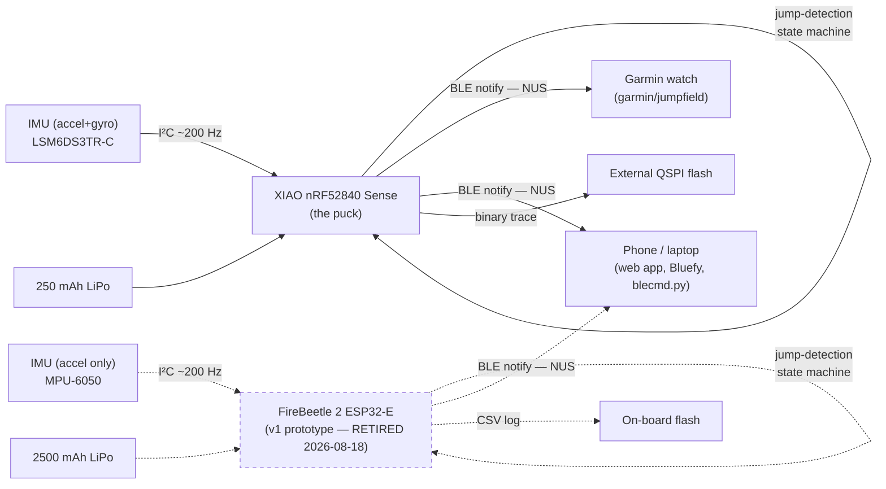

# Jump Height 🪂🌊

**An open-source, open-hardware motion instrument for wing foiling.** Stick a
thumb-sized waterproof puck on the board and it measures what the board actually
does, reading out live on your watch — no phone in the loop. About US$20 in parts.

It starts with the jump — **how high, how long in the air** — because that's the
metric with a clean answer and a market to check against. But the puck is a
6-axis IMU on the deck of a foilboard, and the roadmap is the rest of what that
can see: spins, carves, lean angle, turn radius, time on foil. New measurements
ship as new keys on the same protocol, so every client picks them up without a
rewrite.

Every software step is one command via `./tools/jump`, and all of it is
**rehearsable with zero hardware** against a simulated device:

```bash
./tools/jump wizard --fake    # rehearse the whole flow today, no hardware
./tools/jump wizard           # the real thing: setup → flash → wiring check →
                              # desk test → drop calibration
./tools/jump validate         # on the water: video ground truth + an error-bar report
./tools/jump report           # stuck? one bundle with everything needed to debug
```

New here? **[DECISIONS.md](DECISIONS.md)** is what was chosen and why.
**[BUILD.md](BUILD.md)** is the hardware runbook **for the retired v1
(FireBeetle ESP32 + MPU-6050) build only** — shopping list, soldering, wiring.
For the board you should actually build, the Sense, the current reference is
**[`docs/sense.md`](docs/sense.md)**; no Sense-specific runbook exists yet.

---

## Status at a glance

| Piece | State |
|---|---|
| **Detection algorithm** | ✅ Proven in sim and on the bench. Shared C++ core, mirrored in Python. |
| **The puck** — XIAO nRF52840 Sense | ✅ On silicon, **three healthy units**, each advertising a unique name (`JumpHeight-XXXX`) since 2026-08-18. There was never an IMU-bus fault: two "dead board" verdicts were both wrong, and the cause was GPIO drive strength — `pinMode()` silently selects a 0.5 mA driver for a pin that IS the sensor's power supply. **Nothing was ever damaged** (DECISIONS #37; the wrong turns are kept in [`docs/rca-sense-imu-2026-08-11.md`](docs/rca-sense-imu-2026-08-11.md)). Fully wireless firmware pipeline: OTA gate passed twice back-to-back, bootloader upgraded over the air. |

> **Which board is which?** Only the OG (`JumpHeight-E2C4`) has a battery; the spare (`JumpHeight-45ED`) is USB-only. Identity, batteries and the BLE-pinning rule live in [`docs/bench-playbook.md` §1](docs/bench-playbook.md).

| **v1 prototype** — FireBeetle ESP32 | 🪦 **Retired 2026-08-18** (owner decision), not merely frozen. It is the rig the algorithm was proven on and it stays listed as history — but the platform code, its PlatformIO envs, its partition map and the browser flasher are all deleted, so it cannot be built, flashed or flown any more. The Sense carries the water day. See [`docs/STATUS.md`](docs/STATUS.md) → *HARDWARE DEPRECATION*. |
| **Browser app** | ✅ Live BLE stats, session sync, charts. In-browser flashing was **removed 2026-08-18** with the ESP32 platform (ESP Web Tools cannot flash an nRF52). The Sense flashes by `.uf2` drag-drop or `./tools/jump flash` over USB, and over the air via `tools/otadfu.py`. |
| **Garmin watch field** | ✅ **M2 closed 2026-08-18** — jumps rendered on a real wrist (Epix Gen 2): 3 stored desk tosses reconciled on connect, then 10 live `fakejump`s one by one, and the saved activity's FIT carries the developer fields. |
| **Battery & power** | ✅ **Measured, not estimated (2026-08-18).** ≥25.7 h idle on one charge — the death run walked past the gauge's "empty" and kept going. Cell is LP502030+PCM, 250 mAh, 3.0 V cut-off. Idle draw **≤10 mA by conservation of charge**, which refutes the 16 mA the voltage gauge produced. The internal DC/DC regulator was confirmed usable on hardware — the largest remaining power win, still one line of existing code. |
| **Phase 2 — the water day** | 🌊 **Next.** Nothing here has been in the ocean yet. |

**Watch-numbers bug, root-caused and now closed on the wrist (2026-08-18).**
Connect IQ negotiates the minimum BLE packet size, so jump lines fragmented five
ways and under-paced sending lost fragments — the watch then displayed values the
puck never sent. Fixed on both ends (puck paces to the negotiated link; the watch
rejects lines that fail protocol invariants instead of displaying them). On the
closing run the field found and paired a puck by itself, reconciled the 3 stored
desk tosses on connect, then rendered 10 live `fakejump`s one by one, and the
saved activity's FIT carried `jumps=13` / `best_jump=4.216 ft` — the 1.285 m desk
toss, in the owner's units. Full account and the remaining watch work (Instinct
field sizes, the background-page test, watch self-health) are in
[`docs/STATUS.md`](docs/STATUS.md); the two confidently-wrong diagnoses along the
way are kept as dead ends in
[`garmin/FIRST_COMPILE.md`](garmin/FIRST_COMPILE.md).

---

## What it measures

Three honest tiers. Only the first one is real today.

**Running on hardware.** Jump height, airtime, jump count and session best —
detected on the puck itself, streamed live over BLE, logged to onboard flash, and
displayed on the watch alongside the puck's own battery level.

**Validated in simulation, not yet on silicon.** Spins. An accel-only detector
*fails* on a spinning jump: at ~300 dps the rotation holds |a| above the free-fall
gate and by ~518 dps it trips the false-landing test, giving height errors of
−80…−97%. The fix — per-sample ω²r subtraction on the detector hot path, plus a
lever-arm calibration — is designed and sim-proven, and is why the gyro became a
hard requirement rather than a recording extra
([DECISIONS #29](DECISIONS.md), [`docs/gyro-sim-plan.md`](docs/gyro-sim-plan.md)).

**Mapped, and deliberately waiting on water.** Carve-g, yaw turn-rate, turn
segmentation and count, rail/lean angle, turn radius without GPS, ride smoothness,
chop exposure, time on foil, crash counter, landing quality
([`docs/riding-dynamics-map.md`](docs/riding-dynamics-map.md)). The measurement
kernels are closed-form rigid-body kinematics and buildable at a desk; the
*thresholds* are not. Guessing at a desk what foiling feels like to a sensor
produces fiction, so those wait for one labeled, video-synced session.

The reason this list can grow at all is the protocol: every reading is a
`key=value` on the same newline-terminated stream, and every client already
ignores keys it doesn't recognise. A new metric is a new key — no client rewrite,
no version negotiation, no breakage for the puck you already built.

---

## The one idea that makes this work

You might expect to measure height by integrating acceleration twice (accel →
velocity → position). **Don't.** Tiny sensor errors accumulate into meters of
drift within seconds. Commercial jump trackers sidestep this with the
**airtime method**:

1. When the board leaves the water, it's a projectile in **free-fall** — an
   accelerometer riding on it reads **~0 g**.
2. When it lands, there's a **sharp acceleration spike** (several g).
3. The time between takeoff and landing is the **airtime `T`**.
4. Because a jump off flat water is a symmetric parabola, height follows directly:

```
        g · T²
   h =  ------            (g = 9.81 m/s²)
          8
```

| Airtime `T` | Jump height `h` |
|------------:|----------------:|
| 0.5 s       | 0.31 m (1.0 ft) |
| 1.0 s       | 1.23 m (4.0 ft) |
| 1.5 s       | 2.76 m (9.1 ft) |
| 2.0 s       | 4.90 m (16 ft)  |

So the whole problem reduces to **reliably detecting the takeoff and landing
instants** in a noisy accelerometer signal. That's a solvable signal-processing
problem — and it's what the code in this repo does.

Full derivation, assumptions and edge cases:
[`docs/algorithm.md`](docs/algorithm.md).

### Does that actually hold for a wing?

This is the assumption everything rests on, and it had no literature behind it —
so it got tested rather than asserted.

A **kite** pulls you through the arc, so the parabola lies and kite devices
overshoot by **2.31×**. A **wing** can't: your arms cap how much vertical lift you
can add mid-air, which keeps the flight near-ballistic. Monte-Carlo over **200,000**
simulated jumps — varying wind, wing coefficient, technique, rider mass and jump
size — puts the overshoot at **mean 1.013×, p99 1.062×**, with a method
physics-floor **RMSE of 4.6 cm**.

It also found the method's edge, which is worth stating plainly: **5 jumps in
200,000 are missed entirely** — silently, with nothing shown and nothing logged.
All five are the same case, a wing sheeted constant in 40-knot wind holding enough
lift that free-fall never registers. The boundary is exactly the detector's 0.35 g
gate. That's the kite exception showing up in miniature, so it confirms the theory
rather than denting it — but a silent miss is the worst failure class there is, so
it's documented rather than rounded away ([DECISIONS #30](DECISIONS.md)).

For scale, published field accuracy for commercial kite jump devices runs
**0.51–0.95 m** (Marčiš 2021). Those are real-world numbers and ours is a
simulated floor — not the same kind of measurement — but it does say the *method*
is nowhere near the accuracy bottleneck. Mounting and calibration are.

**None of it has been in the ocean.** The sim de-risks the water day; it doesn't
replace it.

### Where the evidence lives

| | |
|---|---|
| [`docs/algorithm.md`](docs/algorithm.md) | The physics, the signal, the detection state machine, tunables, known limits |
| [`docs/wing-ballistic-sim.md`](docs/wing-ballistic-sim.md) | Is the airtime method valid for wings? The study behind the numbers above |
| [`docs/research.md`](docs/research.md) | Literature and market synthesis, what the sea teaches, open-source triage, reading list — including a section correcting this project's own earlier claims |
| [`docs/gyro-sim-plan.md`](docs/gyro-sim-plan.md) | Why spins break an accel-only detector, and the one sim worth running |
| [`docs/gyro-prior-art.md`](docs/gyro-prior-art.md) | Rotation counting, fusion libraries, patents |
| [`docs/riding-dynamics-map.md`](docs/riding-dynamics-map.md) | The on-water metric map: measurement kernels vs thresholds |
| [`sim/experiments/`](sim/experiments/) | The runnable batteries behind all of the above |

---

## Architecture


```mermaid
flowchart LR
    IMU2["IMU (accel+gyro)\nLSM6DS3TR-C"] -->|I²C ~200 Hz| Sense["XIAO nRF52840 Sense\n(the puck)"]
    Sense -->|jump-detection\nstate machine| Sense
    Sense -->|BLE notify — NUS| Watch["Garmin watch\n(garmin/jumpfield)"]
    Sense -->|BLE notify — NUS| Phone["Phone / laptop\n(web app, Bluefy, blecmd.py)"]
    Sense -->|binary trace| QSPI["External QSPI flash"]
    Bat2["250 mAh LiPo"] --> Sense

    %% historical branch — retired 2026-08-18, drawn dashed, no longer buildable
    IMU1["IMU (accel only)\nMPU-6050"] -.->|I²C ~200 Hz| ESP32["FireBeetle 2 ESP32-E\n(v1 prototype — RETIRED 2026-08-18)"]
    ESP32 -.->|jump-detection\nstate machine| ESP32
    ESP32 -.->|BLE notify — NUS| Phone
    ESP32 -.->|CSV log| Flash["On-board flash"]
    Bat1["2500 mAh LiPo"] -.-> ESP32
    style ESP32 stroke-dasharray: 5 5
```

The dashed branch is history, kept so the two-board story stays legible. That
platform's code was deleted on 2026-08-18 — git keeps it, the build does not.

One detector, three places it runs, kept deliberately in sync:

- **[`firmware/`](firmware/)** — the shared C++ detector
  (`include/jump_detector.h`) runs unmodified on every board; a thin platform
  seam (`src/platform/{nrf52,host}/` — `esp32/` was deleted 2026-08-18)
  supplies the IMU/BLE/storage glue per chip. `host` compiles the real firmware
  core natively for the test suite, so most bugs die without a board. The
  two-board split is why: keeping the detector chip-neutral is what let the
  project change chips without rewriting the thing that actually measures jumps.
- **[`sim/`](sim/)** — a pure-Python mirror (`detector.py`) plus a synthetic-data
  generator and a physics model of a wing jump, so the algorithm can be developed,
  tuned and *statistically characterised* with no hardware at all.
- **[`garmin/`](garmin/)** — a Connect IQ data field that speaks the same
  protocol. No phone in the loop: the puck talks straight to your wrist.

Everything tunable lives in **`config/params.json`** — one file feeds firmware,
simulator and analysis, so they cannot drift apart.

---

## Quick start — no hardware needed (2 minutes)

Requires only Python 3.8+, no dependencies:

```bash
git clone <this-repo>
cd Jump-height
python3 sim/run.py
```

The detector picks synthetic jumps out of a synthetic signal and scores itself
against known ground truth (`RESULT: PASS ✅`). Tweak thresholds in
`config/params.json`, re-run, see the effect immediately.

```bash
python3 sim/run.py --csv data/my_session.csv   # replay a real capture
./tools/jump simtest                            # the full suite, still no hardware
```

---

## Hardware

**Build this one** — Seeed XIAO nRF52840 Sense + a 250 mAh LiPo, ~US$15–20.
The IMU is on the board, so there is no sensor wiring at all: a thumb-sized
puck, bring-up complete on real silicon, and the only build that talks to a
Garmin watch. Spec and gap analysis: [`docs/sense.md`](docs/sense.md).

<details>
<summary><b>v1 prototype — FireBeetle ESP32 + MPU-6050</b> (RETIRED 2026-08-18; history, not a build option)</summary>

DFRobot FireBeetle 2 ESP32-E + MPU-6050 + 2500 mAh LiPo + waterproof capsule.
This is the rig the algorithm was actually proven on. It was feature-frozen on
2026-07-29 (DECISIONS #27) and **retired outright on 2026-08-18** — the platform
seams, the MPU-6050 driver, the `firebeetle32` PlatformIO envs, the partition map
and the browser flasher were all deleted, so this build can no longer be compiled
or flashed. It never took water-day duty: the Sense carries that. Accel-only,
±8 g, and it does not drive the watch. Git history keeps every line of it, and
the reasoning is in [`docs/STATUS.md`](docs/STATUS.md) → *HARDWARE DEPRECATION*.

</details>

Note on power (**measured 2026-08-18, supersedes every estimate in the docs**):
the cell is an **LP502030 + PCM, 250 mAh typ**, 3.7 V nominal, 3.0 ± 0.1 V
over-discharge cut-off, max charge 250 mA (1.0C), JST-PHR-02 2 mm pigtail.
Measured endurance is **≥25.7 h idle on one charge** — a deliberate run-to-death
walked past the gauge's "empty" and was still answering — which bounds idle draw
at **≤10 mA** by conservation of charge. Any "~15 h" or "~60 h" figure elsewhere
in the docs predates that measurement. `docs/sense.md`'s power arithmetic also
still assumes the 500 mAh part originally ordered (flagged at
`docs/sense.md:138`). The live numbers are in [`docs/STATUS.md`](docs/STATUS.md);
the method, and why the percentage gauge was retired, in
[`docs/battery-measurement.md`](docs/battery-measurement.md).

**Waterproofing notes** (the part that actually kills these projects) and the
general BOM/power-budget menu: [`docs/hardware.md`](docs/hardware.md) — but read
its banner first: its Phase 1/2 part tables are the retired ESP32 + MPU-6050 era,
not the Sense.

---

## How this repo handles being wrong

Two files are load-bearing and unusual enough to call out. When code is written
that hardware hasn't yet contradicted, every guess gets numbered up front, then
edited in place once silicon answers it:

- **[`firmware/SENSE_FIRST_BOOT.md`](firmware/SENSE_FIRST_BOOT.md)** — every
  assumption the nRF52 port made before the board existed.
- **[`garmin/FIRST_COMPILE.md`](garmin/FIRST_COMPILE.md)** — the same for the
  Connect IQ field, written with no SDK in hand.
- **[`docs/bench-playbook.md`](docs/bench-playbook.md)** — the operational
  doctrine those files taught: board registry, instrument rules ("a
  diagnostic that can false-negative is worse than none"), transport
  distrust, and the recovery ladder — every rung proven on silicon.

It earns its keep. The bug that killed the watch field on its first live
connection was **predicted, by line number, as item #3** — and the fix listed
there is the fix that shipped. Both files also record *dead ends*, so a wrong
theory only costs the repo once.

If you're debugging the watch: it writes its own crash log to
`GARMIN/Apps/TEMP/CIQ_LOG.YML` with file, line and function. Read that before
theorising.

---

## Repo layout

```
Jump-height/
├── README.md            ← you are here
├── BUILD.md             ← the hardware-day runbook + shopping list
├── DECISIONS.md         ← the design decisions and why
├── config/params.json   ← ALL tunable settings — feeds firmware + sim + analysis
├── tools/
│   ├── jump             ← the one-command interface (wizard/flash/selftest/desktest/
│   │                      drop/sync/validate/replay/eval/web/report)
│   ├── blecmd.py        ← talk to the puck over BLE from the laptop (no phone)
│   ├── chargelog.py     ← battery logging over serial → CSV
│   └── fake_device.py   ← simulated device: rehearse and test with no hardware
├── web/                 ← browser app: live BLE stats, session sync, charts
├── .github/workflows/   ← CI: full test suite + firmware build; publishes the
│                          Sense .uf2 to Pages
├── firmware/
│   ├── include/jump_detector.h          ← portable detection state machine
│   ├── src/platform/{nrf52,host}/       ← per-board glue (host = tests, no board)
│   └── SENSE_FIRST_BOOT.md              ← the nRF52 doubt list (see above)
├── garmin/
│   ├── jumpfield/       ← the Connect IQ data field
│   └── FIRST_COMPILE.md ← the Connect IQ doubt list + open bugs
├── sim/
│   ├── detector.py      ← Python mirror of the firmware detector
│   ├── wing_model.py    ← ballistic wing-jump physics
│   ├── sensor_model.py  ← synthetic IMU incl. gyro / ω²r for spun jumps
│   ├── selfdiag.py      ← airborne median-|a| non-ballistic self-diagnostic
│   ├── evaluate.py      ← score the detector over labeled sessions
│   └── experiments/     ← the sim batteries behind the docs
├── docs/                ← algorithm, hardware, sense (v2), garmin field, roadmap,
│                          research, gyro prior-art + sim plan, data pipeline
└── data/                ← captured/example session CSVs
```

---

## Roadmap

- **Phase 0 — Prove the algorithm (no hardware).** ✅ complete
- **Phase 1 — Bench firmware.** ✅ complete, hardware-validated on the v1 prototype
  (which was frozen 2026-07-29 once it had done its job)
- **Phase 2 — On the water.** 🌊 **next.** Waterproof it, log raw CSV, capture real
  sessions, tune against video ground truth. *Nothing in this repo has been in the
  ocean yet — every accuracy number so far is bench or simulation.*
- **Phase 3 — App.** ✅ complete, hardware-validated
- **Phase 4 — The Sense puck.** 🚧 Where the work is. Bring-up S0 done on silicon;
  the Garmin field is live on the wrist. It takes over water duty once it clears the
  same bench → drop-cal → bucket → water gauntlet the v1 rig already survived.

Acceptance criteria per phase: [`docs/roadmap.md`](docs/roadmap.md).

---

## Contributing & license

Contributions welcome — this is meant to be a community project. Software/firmware is
**MIT** licensed; hardware files (when added) target **CERN-OHL-S** and docs
**CC BY-SA 4.0**. See [`LICENSE`](LICENSE).
