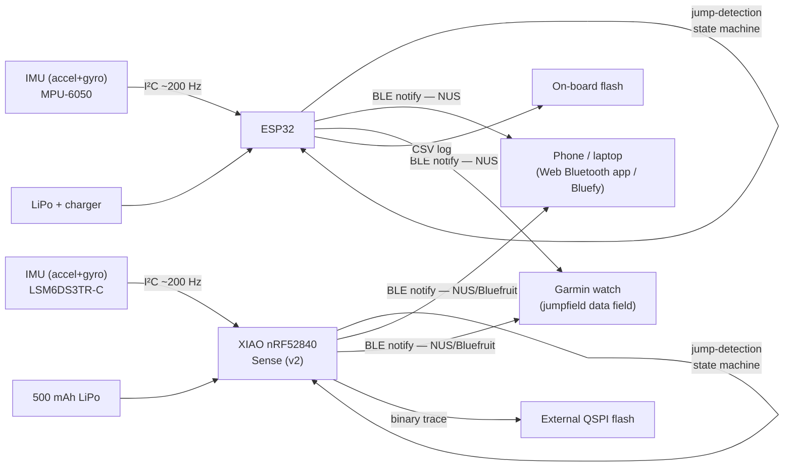

# Jump Height 🪂🌊

**An open-source, open-hardware jump tracker for wing foiling** — a DIY alternative
to the [Woo](https://www.woosports.com/). Stick a small waterproof sensor on the
board, go send it, and find out **how high you jumped** and **how long you were in
the air**.

> Status: **Phases 0/1/3 complete; Phase 2 (the water day) is next.** Building
> it is wires-and-glue only — every software step is one command via
> `./tools/jump` (guided wizard, flash, wiring self-test, desk test, drop-test
> calibration, session sync, video-ground-truth validation), all
> **rehearsable with zero hardware** against a simulated device. The firmware
> — a shared core plus thin per-platform seams — compiles clean for the ESP32
> (shipping) and the tiny XIAO nRF52840 Sense (v2, all-in; see
> [`docs/sense.md`](docs/sense.md)), and speaks its protocol over **Bluetooth**
> to a phone, a Garmin watch ([`garmin/`](garmin/)), or the **browser app**
> (`./tools/jump web`) built sunlight-first for the beach: live jump stats via
> Web Bluetooth (feet-or-meters, glare-readable), one-tap **Sync** with real
> progress, per-session charts, a shareable session card, backup/restore, and
> in-browser flashing via ESP Web Tools. Start with **[BUILD.md](BUILD.md)**
> (the runbook) and **[DECISIONS.md](DECISIONS.md)** (what was chosen and why).
>
> ```bash
> ./tools/jump wizard           # plug in and follow along: setup → flash →
>                               # wiring check → desk test → calibration
> ./tools/jump wizard --fake    # rehearse the exact same flow today, no hardware
> ./tools/jump validate         # on the water: video ground-truth calibration +
>                               # a publishable error-bar report
> ./tools/jump report           # stuck? one file with everything Claude needs
>                               # to troubleshoot remotely (logs, config, self-test)
> ```

---

## The one idea that makes this work

You might expect to measure height by integrating acceleration twice (accel →
velocity → position). **Don't.** Tiny sensor errors accumulate into meters of
drift within seconds. Commercial devices (Woo, Surfr) sidestep this with the
**airtime method**:

1. When the board leaves the water, it's a projectile in **free-fall** — an
   accelerometer riding on it reads **~0 g**.
2. When it lands, there's a **sharp acceleration spike** (several g).
3. The time between takeoff and landing is the **airtime `T`**.
4. Because a jump off flat water is a symmetric parabola, height follows directly:

```
        g · T²
   h =  ------            (g = 9.81 m/s²)
          8
```

| Airtime `T` | Jump height `h` |
|------------:|----------------:|
| 0.5 s       | 0.31 m (1.0 ft) |
| 1.0 s       | 1.23 m (4.0 ft) |
| 1.5 s       | 2.76 m (9.1 ft) |
| 2.0 s       | 4.90 m (16 ft)  |

So the whole problem reduces to **reliably detecting the takeoff and landing
instants** in a noisy accelerometer signal. That's a solvable signal-processing
problem — and it's what the code in this repo does.

See [`docs/algorithm.md`](docs/algorithm.md) for the full derivation, assumptions,
and edge cases.

---

## Architecture


```mermaid
flowchart LR
    IMU1["IMU (accel+gyro)\nMPU-6050"] -->|I²C ~200 Hz| ESP32
    ESP32 -->|jump-detection\nstate machine| ESP32
    ESP32 -->|BLE notify — NUS| Phone["Phone / laptop\n(Web Bluetooth app / Bluefy)"]
    ESP32 -->|BLE notify — NUS| Watch["Garmin watch\n(jumpfield data field)"]
    ESP32 -->|CSV log| Flash["On-board flash"]
    Bat1["LiPo + charger"] --> ESP32

    IMU2["IMU (accel+gyro)\nLSM6DS3TR-C"] -->|I²C ~200 Hz| Sense["XIAO nRF52840\nSense (v2)"]
    Sense -->|jump-detection\nstate machine| Sense
    Sense -->|BLE notify — NUS/Bluefruit| Phone
    Sense -->|BLE notify — NUS/Bluefruit| Watch
    Sense -->|binary trace| QSPI["External QSPI flash"]
    Bat2["500 mAh LiPo"] --> Sense
```

The same detection algorithm runs in two places, kept intentionally in sync:

- **[`firmware/`](firmware/)** — the shared C++ detector
  (`include/jump_detector.h`) runs unmodified on every board; a thin platform
  seam (`src/platform/{esp32,nrf52,host}/`) supplies the IMU/BLE/storage glue
  per chip — ESP32 (FireBeetle 2 + MPU-6050, shipping) and nRF52 (XIAO Sense +
  LSM6DS3TR-C, v2 build-ahead); `host` compiles the real firmware core
  natively for the test suite, no board required.
- **[`sim/`](sim/)** — a pure-Python mirror (`detector.py`) plus a synthetic-data
  generator, so you can develop and tune the algorithm **without hardware** and
  replay real captured sessions offline.

---

## Repo layout

```
Jump-height/
├── README.md            ← you are here
├── BUILD.md             ← the hardware-day runbook + shopping list (start here to build)
├── DECISIONS.md         ← the v1 design decisions and why
├── config/params.json   ← ALL tunable settings — one file feeds firmware + sim + analysis
├── tools/
│   ├── jump             ← the one-command interface: wizard/flash/selftest/desktest/drop/sync/validate/web/report
│   ├── fake_device.py   ← simulated device (rehearse + test everything with no hardware)
│   └── gen_params.py    ← bakes config/params.json into a firmware header
├── web/                 ← browser app: live BLE stats, sessions/CSV over USB, in-browser flasher
├── .github/workflows/   ← CI: full test suite + firmware build, publishes ESP32 binaries + the Sense .uf2 to Pages
├── docs/
│   ├── algorithm.md          ← the physics + detection state machine, in detail
│   ├── garmin-datafield.md   ← the Garmin watch data-field spec
│   ├── hardware.md           ← bill of materials, wiring, power, waterproofing
│   ├── ota.md                ← retired ESP32 OTA spec (tombstone — the Sense updates via Nordic DFU)
│   ├── research.md           ← literature/market synthesis backing the design choices
│   ├── roadmap.md            ← phased build plan (bench → firmware → water → app → v2)
│   ├── solder.md             ← iron + multimeter runbook (headers; the Sense's battery pigtail)
│   └── sense.md              ← v2 (XIAO nRF52840 Sense) port spec + gap analysis
├── firmware/            ← shared core + per-platform seams (PlatformIO)
│   ├── platformio.ini
│   ├── include/jump_detector.h          ← portable detection state machine
│   └── src/platform/{esp32,nrf52,host}/ ← IMU/BLE/storage glue per board (host = tests, no board)
├── garmin/               ← Connect IQ data field (jumpfield/) — the watch as a display surface
├── sim/                  ← develop & test the algorithm with no hardware
│   ├── detector.py      ← Python mirror of the firmware detector
│   ├── generate.py      ← synthesize IMU sessions with known jumps
│   └── run.py           ← run detector on synthetic or captured data
└── data/                 ← captured/example session CSVs
```

---

## Quick start — no hardware needed (2 minutes)

Prove the concept on your laptop. Requires only Python 3.8+ (no dependencies):

```bash
git clone <this-repo>
cd Jump-height
python3 sim/run.py
```

You'll see the detector pick out synthetic jumps and compare its height estimates
against the known ground truth. This is your development sandbox: tweak thresholds
in **`config/params.json`** (the single source of truth for firmware, simulator, and
analysis alike), re-run, and see the effect instantly. The same detector logic is
already ported to `firmware/include/jump_detector.h` and consumes the same config.

Replay a real capture (once you have hardware logging CSVs):

```bash
python3 sim/run.py --csv data/my_session.csv
```

---

## Hardware quick start

Two supported builds, ~US$15–30 in parts:

| Build | Parts | Status |
|-------|-------|--------|
| **v1 (validated)** | DFRobot FireBeetle 2 ESP32-E + MPU-6050 + 2500 mAh LiPo + waterproof capsule | Hardware-validated on the bench; flies the first water sessions. Feature-frozen (bugfix-only, DECISIONS #27). |
| **v2 (build-ahead done)** | Seeed XIAO nRF52840 Sense (IMU on board — no wiring) + 500 mAh LiPo | Firmware compiles and is published as a drag-and-drop `.uf2`; awaiting the physical board. See [`docs/sense.md`](docs/sense.md). |

Full BOM, wiring diagram, power budget, and **waterproofing notes** (the part that
actually kills these projects) are in [`docs/hardware.md`](docs/hardware.md).

---

## Roadmap

- **Phase 0 — Prove the algorithm (no hardware):** run the simulator. ✅ **complete**
- **Phase 1 — Bench firmware:** ESP32 + IMU on a breadboard, self-test, desk test,
  drop calibration. ✅ **complete**, hardware-validated. The ESP32/FireBeetle
  build is feature-frozen as of 2026-07-29 (bugfix-only; DECISIONS #27).
- **Phase 2 — On the water:** waterproof it, log raw CSV, capture real sessions,
  tune thresholds offline against video ground truth. 🌊 **next** — the water day.
- **Phase 3 — App:** BLE + a browser app for live stats, session history, and
  in-browser flashing. ✅ **complete**, hardware-validated.
- **Phase 4 — Real hardware:** custom PCB or an off-the-shelf shortcut, better IMU,
  GPS for speed/distance, sleep modes, potted enclosure. **ALL-IN** on the XIAO
  nRF52840 Sense as the v2 board — the software build-ahead is done
  ([`docs/sense.md`](docs/sense.md)); it takes over water-day duty once it
  passes the same bench → bucket → water gauntlet the ESP32 rig already did.

Details and acceptance criteria per phase: [`docs/roadmap.md`](docs/roadmap.md).

---

## Contributing & license

Contributions welcome — this is meant to be a community project. Software/firmware is
**MIT** licensed; hardware files (when added) target **CERN-OHL-S** and docs
**CC BY-SA 4.0**. See [`LICENSE`](LICENSE).

Not affiliated with or endorsed by Woo Sports. "Woo" is referenced only as prior art.
