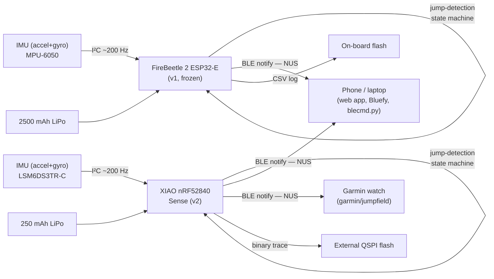

# Jump Height 🪂🌊

**An open-source, open-hardware jump tracker for wing foiling** — a DIY alternative
to the [Woo](https://www.woosports.com/). Stick a small waterproof sensor on the
board, go send it, and find out **how high you jumped** and **how long you were in
the air**.

Every software step is one command via `./tools/jump`, and all of it is
**rehearsable with zero hardware** against a simulated device:

```bash
./tools/jump wizard --fake    # rehearse the whole flow today, no hardware
./tools/jump wizard           # the real thing: setup → flash → wiring check →
                              # desk test → drop calibration
./tools/jump validate         # on the water: video ground truth + an error-bar report
./tools/jump report           # stuck? one bundle with everything needed to debug
```

New here? **[BUILD.md](BUILD.md)** is the hardware runbook,
**[DECISIONS.md](DECISIONS.md)** is what was chosen and why.

---

## Status at a glance

| Piece | State |
|---|---|
| **Detection algorithm** | ✅ Proven in sim and on the bench. Shared C++ core, mirrored in Python. |
| **v1 puck** — FireBeetle ESP32 + MPU-6050 | ✅ Hardware-validated. **Feature-frozen** (bugfix-only, DECISIONS #27) — it is the rig that goes in the water first. |
| **v2 puck** — XIAO nRF52840 Sense | ✅ On silicon. Bring-up milestone S0 complete: two real QSPI bugs found and fixed on hardware, battery telemetry, soft power-off proven both directions. |
| **Browser app** | ✅ Live BLE stats, session sync, charts, in-browser flashing. |
| **Garmin watch field** | 🟡 **Live on the wrist** (Epix Gen 2, 2026-08-11) — a real toss registered. Numbers are **not yet trustworthy**: see the open bug below. |
| **Phase 2 — the water day** | 🌊 **Next.** Nothing here has been in the ocean yet. |

**Open bug, stated plainly:** with a second BLE central connected, the watch
displays values the puck never sent (a count of 64 when the device reported 1).
Cause not yet found; two confident diagnoses were already wrong and are recorded
as dead ends in [`garmin/FIRST_COMPILE.md`](garmin/FIRST_COMPILE.md). Don't trust
numbers on the watch face until that closes.

---

## The one idea that makes this work

You might expect to measure height by integrating acceleration twice (accel →
velocity → position). **Don't.** Tiny sensor errors accumulate into meters of
drift within seconds. Commercial devices (Woo, Surfr) sidestep this with the
**airtime method**:

1. When the board leaves the water, it's a projectile in **free-fall** — an
   accelerometer riding on it reads **~0 g**.
2. When it lands, there's a **sharp acceleration spike** (several g).
3. The time between takeoff and landing is the **airtime `T`**.
4. Because a jump off flat water is a symmetric parabola, height follows directly:

```
        g · T²
   h =  ------            (g = 9.81 m/s²)
          8
```

| Airtime `T` | Jump height `h` |
|------------:|----------------:|
| 0.5 s       | 0.31 m (1.0 ft) |
| 1.0 s       | 1.23 m (4.0 ft) |
| 1.5 s       | 2.76 m (9.1 ft) |
| 2.0 s       | 4.90 m (16 ft)  |

So the whole problem reduces to **reliably detecting the takeoff and landing
instants** in a noisy accelerometer signal. That's a solvable signal-processing
problem — and it's what the code in this repo does.

**Does it hold for a wing?** A kite pulls you through the arc, so the parabola
lies — commercial kite devices overshoot by ~2.3×. A wing is close to ballistic.
Simulated across a realistic population of jumps, the method overshoots by only
**1.0–1.07×**: [`docs/wing-ballistic-sim.md`](docs/wing-ballistic-sim.md).

Full derivation, assumptions and edge cases:
[`docs/algorithm.md`](docs/algorithm.md).

---

## Architecture


```mermaid
flowchart LR
    IMU1["IMU (accel+gyro)\nMPU-6050"] -->|I²C ~200 Hz| ESP32["FireBeetle 2 ESP32-E\n(v1, frozen)"]
    ESP32 -->|jump-detection\nstate machine| ESP32
    ESP32 -->|BLE notify — NUS| Phone["Phone / laptop\n(web app, Bluefy, blecmd.py)"]
    ESP32 -->|CSV log| Flash["On-board flash"]
    Bat1["2500 mAh LiPo"] --> ESP32

    IMU2["IMU (accel+gyro)\nLSM6DS3TR-C"] -->|I²C ~200 Hz| Sense["XIAO nRF52840\nSense (v2)"]
    Sense -->|jump-detection\nstate machine| Sense
    Sense -->|BLE notify — NUS| Phone
    Sense -->|BLE notify — NUS| Watch["Garmin watch\n(garmin/jumpfield)"]
    Sense -->|binary trace| QSPI["External QSPI flash"]
    Bat2["250 mAh LiPo"] --> Sense
```

One detector, three places it runs, kept deliberately in sync:

- **[`firmware/`](firmware/)** — the shared C++ detector
  (`include/jump_detector.h`) runs unmodified on every board; a thin platform
  seam (`src/platform/{esp32,nrf52,host}/`) supplies the IMU/BLE/storage glue
  per chip. `host` compiles the real firmware core natively for the test suite,
  so most bugs die without a board.
- **[`sim/`](sim/)** — a pure-Python mirror (`detector.py`) plus a synthetic-data
  generator and a physics model of a wing jump, so the algorithm can be developed,
  tuned and *statistically characterised* with no hardware at all.
- **[`garmin/`](garmin/)** — a Connect IQ data field that speaks the same
  protocol. No phone in the loop: the puck talks straight to your wrist.

Everything tunable lives in **`config/params.json`** — one file feeds firmware,
simulator and analysis, so they cannot drift apart.

---

## Quick start — no hardware needed (2 minutes)

Requires only Python 3.8+, no dependencies:

```bash
git clone <this-repo>
cd Jump-height
python3 sim/run.py
```

The detector picks synthetic jumps out of a synthetic signal and scores itself
against known ground truth (`RESULT: PASS ✅`). Tweak thresholds in
`config/params.json`, re-run, see the effect immediately.

```bash
python3 sim/run.py --csv data/my_session.csv   # replay a real capture
./tools/jump simtest                            # the full suite, still no hardware
```

---

## Hardware

Two builds, ~US$15–30 in parts:

| Build | Parts | State |
|-------|-------|-------|
| **v1 — FireBeetle** | DFRobot FireBeetle 2 ESP32-E + MPU-6050 + 2500 mAh LiPo + waterproof capsule | Bench-validated and **feature-frozen**. Stays the water-day rig until v2 passes the same gauntlet. |
| **v2 — Sense** | Seeed XIAO nRF52840 Sense (IMU on board, no wiring) + 250 mAh LiPo | Bring-up S0 complete on real silicon. Drives the Garmin field. See [`docs/sense.md`](docs/sense.md). |

The v2 cell is **250 mAh** as actually installed — much of `docs/sense.md`'s
power arithmetic still assumes the 500 mAh part that was originally ordered
(noted at `docs/sense.md:138`), so halve those runtimes when reading it.

Full BOM, wiring, power budget and **waterproofing notes** (the part that
actually kills these projects): [`docs/hardware.md`](docs/hardware.md).

---

## How this repo handles being wrong

Two files are load-bearing and unusual enough to call out. When code is written
that hardware hasn't yet contradicted, every guess gets numbered up front, then
edited in place once silicon answers it:

- **[`firmware/SENSE_FIRST_BOOT.md`](firmware/SENSE_FIRST_BOOT.md)** — every
  assumption the nRF52 port made before the board existed.
- **[`garmin/FIRST_COMPILE.md`](garmin/FIRST_COMPILE.md)** — the same for the
  Connect IQ field, written with no SDK in hand.

It earns its keep. The bug that killed the watch field on its first live
connection was **predicted, by line number, as item #3** — and the fix listed
there is the fix that shipped. Both files also record *dead ends*, so a wrong
theory only costs the repo once.

If you're debugging the watch: it writes its own crash log to
`GARMIN/Apps/TEMP/CIQ_LOG.YML` with file, line and function. Read that before
theorising.

---

## Repo layout

```
Jump-height/
├── README.md            ← you are here
├── BUILD.md             ← the hardware-day runbook + shopping list
├── DECISIONS.md         ← the design decisions and why
├── config/params.json   ← ALL tunable settings — feeds firmware + sim + analysis
├── tools/
│   ├── jump             ← the one-command interface (wizard/flash/selftest/desktest/
│   │                      drop/sync/validate/replay/eval/web/report)
│   ├── blecmd.py        ← talk to the puck over BLE from the laptop (no phone)
│   ├── chargelog.py     ← battery logging over serial → CSV
│   └── fake_device.py   ← simulated device: rehearse and test with no hardware
├── web/                 ← browser app: live BLE stats, session sync, flasher
├── .github/workflows/   ← CI: full test suite + firmware build; publishes the
│                          ESP32 binaries and the Sense .uf2 to Pages
├── firmware/
│   ├── include/jump_detector.h          ← portable detection state machine
│   ├── src/platform/{esp32,nrf52,host}/ ← per-board glue (host = tests, no board)
│   └── SENSE_FIRST_BOOT.md              ← the nRF52 doubt list (see above)
├── garmin/
│   ├── jumpfield/       ← the Connect IQ data field
│   └── FIRST_COMPILE.md ← the Connect IQ doubt list + open bugs
├── sim/
│   ├── detector.py      ← Python mirror of the firmware detector
│   ├── wing_model.py    ← ballistic wing-jump physics
│   ├── sensor_model.py  ← synthetic IMU incl. gyro / ω²r for spun jumps
│   ├── selfdiag.py      ← airborne median-|a| non-ballistic self-diagnostic
│   ├── evaluate.py      ← score the detector over labeled sessions
│   └── experiments/     ← the sim batteries behind the docs
├── docs/                ← algorithm, hardware, sense (v2), garmin field, roadmap,
│                          research, gyro prior-art + sim plan, data pipeline
└── data/                ← captured/example session CSVs
```

---

## Roadmap

- **Phase 0 — Prove the algorithm (no hardware).** ✅ complete
- **Phase 1 — Bench firmware.** ✅ complete, hardware-validated (ESP32 frozen 2026-07-29)
- **Phase 2 — On the water.** 🌊 **next.** Waterproof it, log raw CSV, capture real
  sessions, tune against video ground truth. *Nothing in this repo has been in the
  ocean yet — every accuracy number so far is bench or simulation.*
- **Phase 3 — App.** ✅ complete, hardware-validated
- **Phase 4 — v2 hardware.** 🚧 In progress on the XIAO nRF52840 Sense. Bring-up S0
  done on silicon; the Garmin field is live on the wrist. It takes over water duty
  once it passes the same bench → drop-cal → bucket → water gauntlet the ESP32 rig
  already survived.

Acceptance criteria per phase: [`docs/roadmap.md`](docs/roadmap.md).

---

## Contributing & license

Contributions welcome — this is meant to be a community project. Software/firmware is
**MIT** licensed; hardware files (when added) target **CERN-OHL-S** and docs
**CC BY-SA 4.0**. See [`LICENSE`](LICENSE).

Not affiliated with or endorsed by Woo Sports. "Woo" is referenced only as prior art.
