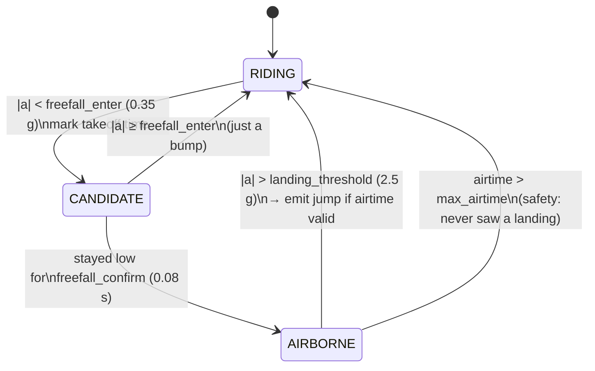

# The algorithm: from raw accelerometer to jump height

This is the heart of the project. It's deliberately simple, robust, and identical
in the firmware ([`firmware/include/jump_detector.h`](../firmware/include/jump_detector.h))
and the simulator ([`sim/detector.py`](../sim/detector.py)).

## Why the airtime method (and not double integration)

The intuitive approach — integrate acceleration to get velocity, integrate again to
get position — **does not work** on cheap IMUs. Any constant bias `b` in the
accelerometer becomes `½·b·t²` of position error. A 0.01 g bias (typical) is
~0.1 m/s², which after just 3 seconds is ~0.44 m of pure drift, and it grows
quadratically. You'd need an expensive, temperature-calibrated, gravity-compensated
inertial platform to make it work. Not happening on a $3 MPU-6050.

The **airtime method** measures *time*, which cheap hardware does extremely
accurately, and converts it to height with physics.

## The physics

While airborne (and ignoring air drag), the board is a projectile. Vertical motion:

```
   y(t) = v₀·t − ½·g·t²
```

Takeoff and landing happen at the same height (the water), so total airtime `T` is
the time for `y` to return to 0:

```
   0 = v₀·T − ½·g·T²   ⟹   v₀ = ½·g·T
```

Peak height is reached at `t = T/2` where vertical velocity is zero:

```
        v₀²      (½·g·T)²      g·T²
   h =  ----  =  --------   =  ----
        2g          2g          8
```

So:

```
   ┌──────────────────┐
   │   h = g · T² / 8  │      with g = 9.80665 m/s²
   └──────────────────┘
```

That's the entire measurement. Everything else is just detecting `T` cleanly.

### What this assumes (and how good the assumptions are)

- **Symmetric parabola / takeoff ≈ landing height.** True for flat-water jumps.
  Landing on the face of a swell breaks it slightly; averages out in practice.
- **Air drag negligible.** For 0.5–2 s airtimes at foil speeds, drag shaves a small
  percentage off — commercial units live with it.
- **The sensor is the thing that flies.** You're measuring how high *the board*
  went, which is exactly the number people care about (and what the Woo reports).

## The signal

Feed the detector a single scalar per sample: the **magnitude** of the acceleration
vector in g-units:

```
   |a| = sqrt(ax² + ay² + az²) / 9.80665
```

Using magnitude makes it **orientation-independent** — it doesn't matter how the
sensor is mounted or how the board spins in the air. Characteristic values:

| Situation            | \|a\| (g)          | Why |
|----------------------|--------------------|-----|
| Sitting still / riding | ~1.0 (+ chop)    | just gravity, plus bumps from chop |
| Pop / load-up before takeoff | 1.5 – 3+   | you edge and unweight to launch |
| **Airborne (free-fall)** | **~0.0**       | projectile: no support force → weightless |
| **Landing impact**   | **spike, 3 – 8+**  | water deceleration |

The airborne ~0 g signature is clean and unmistakable — that's what makes takeoff
detection reliable.

## The detection state machine



Streaming, one sample at a time, O(1) memory:

1. **RIDING → CANDIDATE.** `|a|` drops below `freefall_enter` (0.35 g). Record the
   takeoff time *now* (start of the dip).
2. **CANDIDATE.** If `|a|` pops back up immediately, it was chop — go back to RIDING.
   If it stays low for `freefall_confirm` (~0.08 s), it's a real launch → AIRBORNE.
   (Takeoff time stays pinned to the start of the dip.)
3. **AIRBORNE.** Wait for the landing spike (`|a| > landing_threshold`, 2.5 g).
   `airtime = landing_time − takeoff_time`.
4. **Validate & emit.** Accept only if `min_airtime ≤ airtime ≤ max_airtime`
   (rejects chop-induced blips and stuck states), then report
   `height = g · airtime² / 8`.

## Tunable parameters

Defined once in `Params` (both languages). Start here, tune against real data:

| Parameter | Default | Meaning / how to tune |
|-----------|--------:|-----------------------|
| `freefall_enter_g`   | 0.35 | Lower = stricter takeoff (fewer false positives, may miss soft launches). |
| `freefall_confirm_s` | 0.08 | Debounce; longer rejects sharp chop but delays confirmation. |
| `landing_threshold_g`| 2.50 | Raise if choppy landings retrigger; lower if soft touchdowns are missed. |
| `min_airtime_s`      | 0.25 | Floor; below this it's almost certainly not a real jump. |
| `max_airtime_s`      | 8.0  | Safety cap; also resets a stuck AIRBORNE state. |

Because sample **timing** sets your height accuracy, sample fast and timestamp
precisely: at 200 Hz, ±1 sample (~5 ms) on a 1 s airtime is only ~2 cm of height
error (`dh/dT = g·T/4`). 100–200 Hz is plenty.

## Known limitations / future improvements

- **Drops vs jumps:** riding off a ledge into a drop also produces free-fall +
  landing. The formula reports the fall height, not a "jump." Usually fine.
- **Rotations/wind mid-air** can briefly push `|a|` up; the state machine tolerates
  this because it only exits AIRBORNE on a *landing-sized* spike, not any bump.
- **Air-drag & asymmetric landings** cause a slight systematic under/over-read. A
  future calibration factor (fit against video ground truth) can correct it.
- **Advanced:** a gyro-aided complementary filter can rotate acceleration into the
  world frame and cross-check takeoff via vertical velocity. Airtime stays the
  robust primary; this is a refinement, not a replacement.

## How to validate it

1. **Synthetic:** `python3 sim/run.py` — known jumps in, compare detected height to
   the exact `g·T²/8` ground truth.
2. **Bench:** flash the firmware, toss the board (safely!) or do controlled hand
   drops; compare reported height to a tape measure / high-frame-rate video.
3. **On the water:** film a session at 120–240 fps, count airborne frames for
   ground-truth airtime, and tune the parameters so the detector matches.
