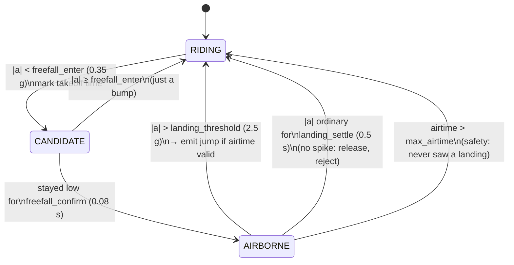

# The algorithm: from raw accelerometer to jump height

This is the heart of the project. It's deliberately simple, robust, and identical
in the firmware ([`firmware/include/jump_detector.h`](../firmware/include/jump_detector.h))
and the simulator ([`sim/detector.py`](../sim/detector.py)).

## Why the airtime method (and not double integration)

The intuitive approach — integrate acceleration to get velocity, integrate again to
get position — **does not work** on cheap IMUs. Any constant bias `b` in the
accelerometer becomes `½·b·t²` of position error. A 0.01 g bias (typical) is
~0.1 m/s², which after just 3 seconds is ~0.44 m of pure drift, and it grows
quadratically. You'd need an expensive, temperature-calibrated, gravity-compensated
inertial platform to make it work. Not happening on a generic cheap consumer IMU
(the LSM6DS3TR-C on the Sense board, or the MPU-6050 on the retired ESP32 build).

The **airtime method** measures *time*, which cheap hardware does extremely
accurately, and converts it to height with physics.

## The physics

While airborne (and ignoring air drag), the board is a projectile. Vertical motion:

```
   y(t) = v₀·t − ½·g·t²
```

Takeoff and landing happen at the same height (the water), so total airtime `T` is
the time for `y` to return to 0:

```
   0 = v₀·T − ½·g·T²   ⟹   v₀ = ½·g·T
```

Peak height is reached at `t = T/2` where vertical velocity is zero:

```
        v₀²      (½·g·T)²      g·T²
   h =  ----  =  --------   =  ----
        2g          2g          8
```

So:

```
   ┌──────────────────┐
   │   h = g · T² / 8  │      with g = 9.80665 m/s²
   └──────────────────┘
```

That's the entire measurement. Everything else is just detecting `T` cleanly.

Calibration ships in the formula today (not "future"): the detector actually
computes `height = height_scale · g · (airtime + airtime_offset_s)² / 8`, where
`airtime_offset_s` (additive, from bench drop tests) and `height_scale`
(multiplicative, from on-water video ground truth) both default to identity
(0.0 and 1.0) so uncalibrated output is exactly `g·T²/8`.

### What this assumes (and how good the assumptions are)

- **Symmetric parabola / takeoff ≈ landing height.** True for flat-water jumps.
  Landing on the face of a swell breaks it slightly; averages out in practice.
- **Air drag negligible.** For 0.5–2 s airtimes at foil speeds, drag shaves a small
  percentage off — commercial units live with it.
- **The sensor is the thing that flies.** You're measuring how high *the board*
  went, which is exactly the number people care about (and what the Woo reports).
- **The reference is the takeoff point, not "sea level."** Naval architecture
  hit this exact ambiguity and resolved it the same way (ITTC "relative wave
  elevation" — height against the local, instantaneous water surface): our
  number is honestly *flight height above the takeoff point*. See
  [research.md §4](research.md).
- **Ballistic flight — verified for free-fall, sim-answered near-ballistic for a
  flown wing.** The method is peer-validated where flight is truly ballistic (ICC
  up to 0.997 vs force plates), and kite jumps are the proven exception (sustained
  kite lift makes ballistic math overpredict ~2.3×, Simons 2025). A hand-held wing
  has no tether mechanism, and simulation now confirms wing airs sit near-ballistic:
  the arm-force ceiling caps any mid-air lift, so airtime `h = g·T²/8` overshoots
  by only 1.00–1.07× (vs the kite's 2.31×), with a Monte-Carlo physics-floor RMSE
  of ~4.2 cm. Pending real-water confirmation (the Phase 2 video calibration), but
  de-risked from simulation. See [wing-ballistic-sim.md](wing-ballistic-sim.md);
  full citations and the design-verdicts table: [research.md §2](research.md).

## The signal

Feed the detector a single scalar per sample: the **magnitude** of the acceleration
vector in g-units:

```
   |a| = sqrt(ax² + ay² + az²) / 9.80665
```

Using magnitude makes it **orientation-independent** — it doesn't matter how the
sensor is mounted or how the board spins in the air. Characteristic values:

| Situation            | \|a\| (g)          | Why |
|----------------------|--------------------|-----|
| Sitting still / riding | ~1.0 (+ chop)    | just gravity, plus bumps from chop |
| Pop / load-up before takeoff | 1.5 – 3+   | you edge and unweight to launch |
| **Airborne (free-fall)** | **~0.0**       | projectile: no support force → weightless |
| **Landing impact**   | **spike, 3 – 8+**  | water deceleration |

The airborne ~0 g signature is clean and unmistakable — that's what makes takeoff
detection reliable.

## The detection state machine


```mermaid
stateDiagram-v2
    [*] --> RIDING
    RIDING --> CANDIDATE: |a| < freefall_enter (0.35 g)\nmark takeoff time
    CANDIDATE --> RIDING: |a| ≥ freefall_enter\n(just a bump)
    CANDIDATE --> AIRBORNE: stayed low for\nfreefall_confirm (0.08 s)
    AIRBORNE --> RIDING: |a| > landing_threshold (2.5 g)\n→ emit jump if airtime valid
    AIRBORNE --> RIDING: |a| ordinary for\nlanding_settle (0.5 s)\n(no spike: release, reject)
    AIRBORNE --> RIDING: airtime > max_airtime\n(safety: never saw a landing)
```

Streaming, one sample at a time, O(1) memory:

1. **RIDING → CANDIDATE.** `|a|` drops below `freefall_enter` (0.35 g). Record the
   takeoff time *now* (start of the dip).
2. **CANDIDATE.** If `|a|` pops back up immediately, it was chop — go back to RIDING.
   If it stays low for `freefall_confirm` (~0.08 s), it's a real launch → AIRBORNE.
   (Takeoff time stays pinned to the start of the dip.)
3. **AIRBORNE.** Wait for the landing spike (`|a| > landing_threshold`, 2.5 g).
   `airtime = landing_time − takeoff_time`. If instead `|a|` stays *ordinary*
   (never dips near free-fall and never spikes) for `landing_settle_s` (0.5 s),
   the flight is over but the landing was never seen — release to RIDING and
   reject. This guards against a stuck-AIRBORNE state going deaf to the next
   takeoff and later closing the stale flight on a stray spike as a monster jump.
4. **Validate & emit.** Accept only if `min_airtime ≤ airtime ≤ max_airtime`
   (rejects chop-induced blips and stuck states), then report
   `height = height_scale · g · (airtime + airtime_offset_s)² / 8`.

## Tunable parameters

Defined once in `Params` (both languages). Start here, tune against real data:

| Parameter | Default | Meaning / how to tune |
|-----------|--------:|-----------------------|
| `freefall_enter_g`   | 0.35 | Lower = stricter takeoff (fewer false positives, may miss soft launches). |
| `freefall_confirm_s` | 0.08 | Debounce; longer rejects sharp chop but delays confirmation. |
| `landing_threshold_g`| 2.50 | Raise if choppy landings retrigger; lower if soft touchdowns are missed. |
| `min_airtime_s`      | 0.25 | Floor; below this it's almost certainly not a real jump. |
| `max_airtime_s`      | 3.0  | Wing physical-plausibility cap (a 3 s air is ~11 m — absurd for a wing); also rejects a stuck AIRBORNE state. Matches `config/params.json` and `sim/detector.py`. |
| `landing_settle_s`   | 0.5  | If `|a|` stays ordinary this long in AIRBORNE, release + reject (no landing spike seen). |
| `airtime_offset_s`   | 0.0  | Additive airtime calibration from bench drop tests; identity by default. |
| `height_scale`       | 1.0  | Multiplicative height calibration from on-water video ground truth; identity by default. |

Because sample **timing** sets your height accuracy, sample fast and timestamp
precisely: at 200 Hz, ±1 sample (~5 ms) on a 1 s airtime is only ~2 cm of height
error (`dh/dT = g·T/4`). 100–200 Hz is plenty.

## Known limitations / future improvements

- **Drops vs jumps:** riding off a ledge into a drop also produces free-fall +
  landing. The formula reports the fall height, not a "jump." Usually fine.
- **Spun jumps break the accel-only detector.** The old claim that "the state
  machine tolerates rotations" is false: a spin injects centripetal `ω²r` into
  `|a|`, and by ~300 dps peak this both re-pins the free-fall gate (missing takeoff)
  and fakes a 2.5 g "landing" spike mid-air. The fix — validated in simulation — is
  to subtract per-sample `ω²r` from `|a|` before the state machine, which makes the
  gyro a **detector hot-path input** (not an optional extra) and requires a
  mount/lever-arm calibration for `r`. See [gyro-sim-plan.md](gyro-sim-plan.md) (g4).
- **Sustained lift makes a jump invisible (silent miss).** If mid-flight specific
  force never drops below `freefall_enter_g` (0.35 g), takeoff is never detected
  and the jump is never reported — nothing on the watch, nothing in the log, no
  flag. Measured over 200,000 simulated jumps: **5 misses (2.5×10⁻⁵)**, all in
  never-depower ("constant") technique at 20–21 m/s wind, and the boundary is
  exactly the gate — every jump at ≥0.35 g was missed, the one at 0.34–0.35 g was
  caught. This is the kite exception in miniature: hold enough lift and a wing
  stops being ballistic. Deliberately **not** fixed by lowering the gate, which
  would trade a rare silent miss for common false takeoffs on chop (DECISIONS #30).
  Real-world exposure is unmeasured — sim puts p99 mid-flight force at 0.067 g,
  comfortably clear, but that is a model.
- **Air-drag & asymmetric landings** cause a slight systematic under/over-read.
  The calibration factors ship in the formula now — `height_scale` (multiplicative)
  and `airtime_offset_s` (additive), fit against video/bench ground truth — so this
  is a tune-the-constants task, not a code change.
- **Self-diagnosis:** the median airborne `|a|` should sit near 0 g for a truly
  ballistic flight; a median `> 0.12 g` flags a non-ballistic (or badly-mounted)
  jump. Without spin this separates ballistic from non-ballistic at AUC 1.0; under
  spin it needs the gyro. See [gyro-sim-plan.md](gyro-sim-plan.md).
- **Beyond the hot-path:** a gyro-aided complementary/AHRS filter can also rotate
  acceleration into the world frame and cross-check takeoff via vertical velocity.
  Airtime stays the robust primary; that world-frame cross-check is a refinement.

## How to validate it

1. **Synthetic:** `python3 sim/run.py` — known jumps in, compare detected height to
   the exact `g·T²/8` ground truth.
2. **Bench:** flash the firmware, toss the board (safely!) or do controlled hand
   drops; compare reported height to a tape measure / high-frame-rate video.
3. **On the water:** film a session at 120–240 fps, count airborne frames for
   ground-truth airtime, and tune the parameters so the detector matches.
