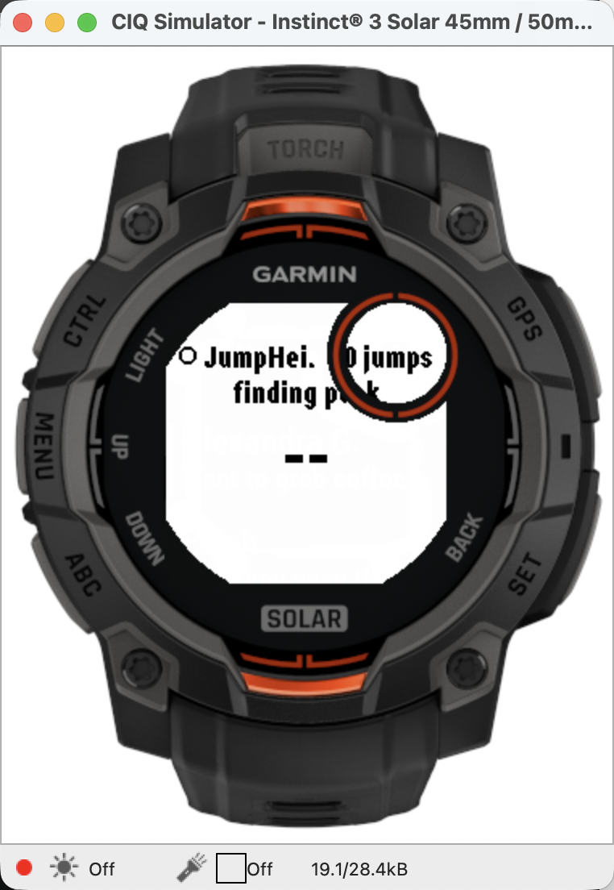

# Instinct night — runbook

Thursday evening, ~90 minutes, the brother and his Instinct 3 Solar. He is
now the rider (owner decision 2026-08-20), so this watch is the product's
only screen on the water and everything "proven" so far was proven on the
wrong watch.

**The scarce resource is his time, not ours.** Everything below that could be
done without him has been done: the suite runs 48/48 on his device target,
memory is measured, the MTP sender is written and compiled, the builds exist.
This page is execution only.

---

## Before he arrives (owner: nothing; me: done)

- [x] Field builds for `instinct3solar45mm`, 12,417 B static of 32,768 B
- [x] 48/48 simulator tests pass **on his device target**
- [x] No per-line memory leak over ~1,200 lines (0 B / 0 B across blocks)
- [x] `tools/mtp_send` built — the ~30 lines of C the README described for
      four days but never committed, which would otherwise have been
      re-derived tonight under time pressure
- [x] OpenMTP installed as the GUI fallback
- [x] Rider brief written
- [x] OG charging (it is the puck for tonight — battery, so the desk test
      can be untethered)

## The sequence, in priority order

**Do them in this order.** If the evening gets cut short, everything after
the cut is recoverable on the weekend; everything before it is not.

### 1. Identify and sideload (~15 min, the risky step)

```bash
mtp-detect | head -20                     # watch answers?
./tools/mtp_send --list                   # storages + GARMIN/Apps folder id
```
**Read the ids off the watch. Do not assume the Epix's `0x00020001`
carries over** — the Instinct has never been sideloaded from this Mac, and
assuming an identifier that was true for a different device is the exact
mistake this project has made four times.

```bash
./tools/mtp_send garmin/jumpfield/bin/JumpField-instinct.prg <apps_id> <storage_id>
mtp-files | grep -A6 'File ID: <id>'      # size matches? parent is Apps?
```
**Fallback if any of this stalls: OpenMTP, drag to `GARMIN/Apps`.** Do not
spend more than ~10 minutes on the CLI path with him sitting there.

Record: his **watch firmware version** (Settings → System → About).

### 2. One-time setup on HIS watch (~5 min, and he should do it)

Settings → Activities & Apps → **Windsurf** → Data Screens → add → Connect IQ
→ Jump Height. Let him drive it — if the setup is confusing, that is a
finding about the product, not about him.

### 3. Layout on the real screen (~10 min)

**LOOK FOR THIS SPECIFICALLY — found in the simulator 2026-08-21:**


The header renders as `JumpHei…  0 jumps` and the count appears to run
UNDER the Instinct's circular sub-display window (upper right). Confirmed not
to be stale compositing — the simulator was killed and relaunched and it
renders identically.

Why the code does not already handle it: `JumpFieldView` asks for
obscurity-aware width (`:188`) and honours `OBSCURE_TOP` / `OBSCURE_BOTTOM`,
and `Layout.safeHalfWidth` applies chord math for ROUND screens. The
Instinct's sub-display is **neither** — it is a hole in the mid-right of an
otherwise usable rectangle, and no CIQ flag describes it.

**What to determine on the real watch, because the simulator cannot settle
it:** is that region actually unreadable on the device, or does the simulator
merely draw the bezel art over a screen the watch itself renders fully?
Photograph the header at each tier. If the text really is obscured, the fix is
a right-edge inset on the header row only, on this device — small and local.


Open the activity, look at every layout tier. **Photograph each.** The 176×176
MIP is monochrome; tier layouts were pinned by unit tests but have never been
seen by a human on this device.

### 4. Desk test (~20 min) — the OG, untethered

- Three real tosses → count, best, and airtime update on his wrist
- `fakejump` over BLE → the corruption gate's `!N` marker
- Vibrate: **US3 has never fired once on any watch** — does it?
- Storage-down row (`NO REC`) if reachable

### 5. THE TWO-CENTRAL TEST (~15 min) — the highest-value item tonight

Epix **and** Instinct both subscribed to the OG, then 20 `fakejump`s.
**Both watches must show 20, and neither may show `!`.**

This is the one thing no amount of bench work can substitute: macOS
multiplexes one BLE link across central managers, so two hosts is the only
real test — and this is exactly the configuration if the owner ever checks
the puck from shore while his brother rides. `dualcentral` already proved the
*bulk export* case (300,022 identical bytes, `tx_drops` 0); this is the
**JUMP-line** case, which is the one that corrupted on 2026-08-11.

**If it fails: no second central while riding. That rule holds until this
passes.**

### 6. Save a real activity (~10 min)

Start → tosses → stop → **save** (not discard). Then pull the FIT and parse
it: developer fields present, units following **his** watch settings. Proven
on the Epix only.

### 7. Rider brief (~5 min)

Hand him [rider-brief.md](rider-brief.md) in person, with the hardware in his
hands. Walk the reboot ritual and "start the activity" once, out loud.

### 8. Stretch, only if time: `onTimerReset` on hardware

Start activity → 3 fakejumps → end → start a new activity → **does the count
restart?** The watch-side session fix depends on this callback firing on real
silicon, and this project has been bitten twice by simulator-vs-device
divergence on exactly this class of thing.

---

## What NOT to do tonight

- **Do not sideload the new session-delta build.** Tonight baselines the
  PROVEN build on an unknown watch; changing both at once means a failure
  tells you nothing. The new build goes on at the weekend, after this passes.
- **Do not flash the OG.** It is the product board and tonight's puck.
- **Do not run a phone/laptop central during the two-watch test** — that
  would be three centrals against a firmware built for two.

## Recording

Everything goes in STATUS under a dated entry, with photographs attached to
the layout rows. **Anything not observed is not recorded as passing** — an
untested row stays untested, not assumed.
