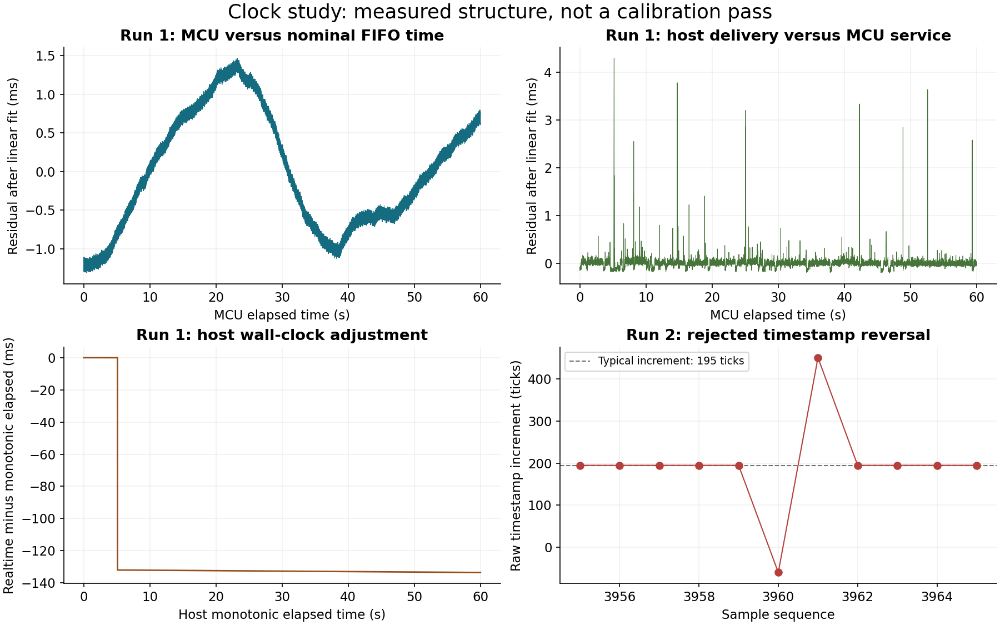

# External-reference clock study and next bench gates

**2026-09-15 EDT / 2026-09-16 UTC. Task 1 has NOT passed. Tasks 2 and 3 have
not started. No calibration constants or time corrections were applied.**

The useful result is that the short-run evidence now favors a sensor timestamp
scale near **24.327 µs/tick**, rather than 25 µs, while MCU time tracks an
externally checked host monotonic clock much more closely. This remains a
diagnostic estimate: a timestamp fault, incomplete duration/temperature tests
and unresolved total uncertainty prevent accepting a calibration.

## Current board and application state

| Item | Measured or recorded state |
|---|---|
| Target | `JumpHeight-8673`, USB UID `2513620E30AE413D`, USB-only |
| Installed application | Research recorder **`9c9289b69af5b76a`**, maximum 60-second captures |
| Prepared application | **`53aac69c2b7e37a8`**, built and reviewed, **NOT installed** |
| Prepared ZIP SHA-256 | `49005bcdb788bbfcd8c0062a8a2644f1c6b9f9886e8539ca268ac2f1ed250d93` |
| Update attempts | Two acknowledged bootloader-entry requests, the second after removing serial contention; no bootloader PID observed and **no upload attempted** |
| Local Sync app | `com.jumpheight.puckd` temporarily stopped with `launchctl bootout`; its plist is unchanged |
| Hardware exclusions | OG untouched; no clear, format, NVS or production calibration writes; no battery readings used |

The prepared build supports 1,200-second captures, actual clock-register
readbacks and temperature STATUS records, and all 18 original FIFO bytes per
sample. It adds evidence, not a guessed clock correction or timestamp repair.
The [board registry](../../docs/bench-playbook.md#research-recorder-lookup-and-restoration--2026-09-15)
contains the product rollback ZIP, exact SHA-256 and tested restoration helper.

## What actually ran

All raw data, host timing and reference packets are retained under
`captures/clock-study-20260915/`. These files are local, git-ignored evidence;
the committed summary, figure and evidence hashes accompany this report.

| Attempt | Samples | Result |
|---|---:|---|
| `short-run1`, requested 60 s | 6,604 valid samples before truncation | **Rejected.** CRC/framing errors and missing END; a competing local Sync process was observed holding the same serial port afterward. |
| `clean-run1`, requested 60 s | 12,640 | Acquisition passed after stopping Sync and acquiring kernel serial exclusivity. |
| `clean-run2`, requested 60 s | 12,640 | **Rejected.** Transport/END counters passed, but one sensor timestamp went backward. |

The original five-second and 30-second recordings remain historical evidence.
The three attempts above are all reported; the failed repeat was not replaced
with a selected successful run. No recording lasted ten continuous minutes.

### Serial ownership was an actual confound

`lsof` identified PID 24200, `/Applications/JumpHeight Sync.app/... --launchd`,
holding `/dev/cu.usbmodem101` after the first failure. This is observed competing
ownership; it does not identify the physical origin of each corrupted byte.
The previous `pyserial exclusive=True` requested an advisory lock, which did not
prevent this client opening the port. The revised host obtains kernel
`TIOCEXCL` before sending commands. That prevents subsequent unprivileged opens;
existing owners must still be checked and stopped first.

Sync remains stopped because the attached board runs the research protocol.
After unplugging the research board or restoring its product firmware, resume
the unchanged launch agent with:

```sh
launchctl bootstrap gui/$(id -u) "$HOME/Library/LaunchAgents/com.jumpheight.puckd.plist"
```

## External reference and quantitative result

The proposed reference is **host `mach_absolute_time()` rate anchored to
read-only external NTP server timestamps**, with separate Google, Cloudflare and
Apple results. TIMER4 and configured ODR are not assumed exact.

Each host read records byte offsets and before/after monotonic and realtime
timestamps. Analysis pairs a host read with its last complete IMU sample;
buffered earlier samples are not assigned duplicate independent observations.
For NTP, server midpoints `(t2+t3)/2` are compared with host monotonic midpoints.
That comparison survives adjustments to the host's wall clock.

**This distinction was necessary:** in clean run 1, host realtime moved
**−133.561 ms relative to monotonic**, including a backward step. The recorded
NTP offsets changed too. An ordinary wall-time regression would misattribute
that adjustment to the MCU or sensor. The cause of the wall-clock adjustment
was not established.

Read-only host evidence shows `timed` running and `/etc/ntp.conf` pointing to
Apple. The settings getters required administrator access despite returning
exit code zero; kernel PLL status was unavailable. Therefore active host clock
discipline and its internal frequency estimate are **not verified**. No clock
settings were changed. Raw NTP requests/responses and failures are preserved.

### Clean run 1: rates and reference-dependent estimates

Rates use **N−1 sample intervals**, or the corresponding host endpoint sequence
difference. 208 Hz is a nominal configuration, not a third independent clock.

| Quantity | Result |
|---|---:|
| Configured ODR | 208 Hz, nominal |
| Sample rate in MCU seconds | 210.677616 Hz |
| Sample rate in host monotonic seconds | 210.675923 Hz |
| Sample rate using nominal 25 µs FIFO ticks | 205.004850 Hz |
| Host monotonic / MCU fitted rate | 1.000006247, **+6.25 ppm** |
| FIFO tick in MCU units | 24.326125832 µs |
| Google NTP correction to host monotonic rate | +23.86 ppm; reference scenario ±96.33 ppm |
| Cloudflare correction | −3.59 ppm; reference scenario ±220.29 ppm |
| Apple correction | +267.68 ppm; reference scenario ±1540.35 ppm |

Using Google's bracket gives **24.326856907 µs/tick**, with a
**reference-only interval of 24.324513446–24.329200368 µs**. Other providers'
scenarios overlap. The reference allowance is half RTT plus server-reported
root timing allowances; it is not a statistical 95% interval. Servers are not
pooled as independent samples, and the fit is not silently corrected.

**There is no defensible total ±ppm claim yet.** That ±96 ppm component excludes
time-varying servicing/USB delay, within-run oscillator variation and transfer
of the NTP anchor rate into the capture. The full total must be established by
the long, repeated and temperature-controlled measurements. A small formal
least-squares standard error is not that total.

### Residual structure and the readout-event hypothesis

Nine FIFO words are **one** complete gyro/accel/timestamp record. Clean run 1
had nine words at every service, with no observed backlog. MCU deltas were
4,582–4,779 µs, while timestamp deltas were 194–196 ticks. Thus service times
have polling/readout structure even when every record is retained.

MCU-versus-FIFO residuals form a pronounced curve, not independent noise:
lag-1 correlation is approximately **0.996**; five-second fitted slopes span
about **391 ppm**. Host-monotonic-versus-MCU residuals have much smaller ordinary
variation plus intermittent delivery spikes. The analysis exports all per-record
deltas, window slopes, residuals and block-bootstrap diagnostics. Bootstrap
results are conditional on stationarity and their selected block length.
These observations do not support attributing the 2.8% scale difference to
nine-sample service batches, but they also do not make readout times exact
sample times.



## Repeat failure: a malformed FIFO timestamp

The complete repeat had 12,642 CRC-valid USB frames, zero device error counters,
continuous sample sequence and nine FIFO words throughout. Nevertheless:

| Sequence | Timestamp ticks | Increment |
|---|---:|---:|
| 3959 | 772668 (`0x0BCA3C`) | +195 |
| 3960 | 772608 (`0x0BCA00`) | **−60** |
| 3961 | 773059 (`0x0BCBC3`) | **+451** |

This is not a 24-bit wrap. A hypothetical value `0x0BCB00` would restore ordinary
increments, but it is **not substituted**. One missing carry and a one-bit error
before USB framing are both compatible with the observation. USB CRC cannot
prove the sensor-to-MCU I²C transaction's data were correct.

The byte-order formula agrees with ST documentation; the bus driver checks
exact transfer counts. Other low-byte-zero samples passed. No documented exact-C
timestamp carry erratum or validated workaround was found. Full raw FIFO
preservation adds padding/step-counter context; the three timestamp bytes were
already recoverable from the decoded integer, so this addition alone cannot
locate the fault. If repeated faults cluster at carry boundaries, delayed FIFO
draining and a logic-analyzer observation are candidate controlled diagnostics.

The original failed manifest reports a fictitious 419-second modular extension;
it already marks the recording unusable and emits no `imu.csv`. It is retained
unchanged. The revised host now distinguishes backward ticks from plausible
wraps and reports null duration/rate on invalid timestamps. The independent
analyzer stops its fits at the fault and labels any prefix analysis explicitly.

## Acceptance ledger and morning sequence

| Gate | Status |
|---|---|
| External NTP observations and host receive timing | Measured; reference uncertainty recorded |
| ≥10 continuous minutes | **Not run:** installed build has 60-second limit |
| Actual HFCLKSTAT / TIMER4 readback | **Not measured:** instrumented build not installed |
| Two fully valid independent runs agreeing <0.1% | **Not passed:** repeat rejected |
| Power-cycle repeat | **Pending operator, morning** |
| ≥20 °C sweep | **Not performed** |
| Total sensor-tick uncertainty in ppm | **Unresolved** |
| Six-pose calibration / known motion | **Not started; blocked by Task 1** |

1. Keep Sync stopped. Double-tap the reset button on **8673** while USB-connected.
   Confirm its exact UID and bootloader PID `0045`, then load the prepared
   application once. Require `Device programmed.` and fresh application
   UID/build verification. An ACK or port path alone is insufficient.
2. Verify a short diagnostic, including actual `HFCLKSTAT`, timer fields,
   temperature and raw/sample pairing, then collect an 11-minute continuous
   recording bracketed by NTP probes. Retain every failure.
3. Unplug USB, wait, reconnect, use the same documented warm-up, and repeat.
   Software DFU/reset earlier this session was **not** a power-cycle experiment.
4. Repeat with a measured ≥20 °C die-temperature change. A fridge and ambient
   room may span less than 20 °C; verify the observed span. Use a dry sealed
   enclosure for the cold test and leave it closed through warm-up to avoid
   condensation on the board. Record equilibration and cable/mount conditions.
   A room thermostat is not an independent board-temperature measurement.

The prepared source sets TIMER4 to 32-bit timer mode, prescaler 4:
`16 MHz / 2^4 = 1 MHz` from HFCLK. A measured `HFCLKSTAT=0x10001` would mean
running crystal source; it has **not yet been read from this board**.
[Nordic CLOCK](https://docs.nordicsemi.com/r/bundle/ps_nrf52840/page/clock.html),
[Nordic TIMER](https://docs.nordicsemi.com/r/bundle/ps_nrf52840/page/timer.html).

Die temperature uses `25 + raw/256` °C. ST specifies potentially ±15 °C absolute
offset, so report coefficients against the nominal die-temperature scale and
retain that uncertainty until an external temperature reference is available.
[ST LSM6DS3TR-C datasheet](https://www.st.com/resource/en/datasheet/lsm6ds3tr-c.pdf).

## Downstream experiment contract

**Task 2, after Task 1 passes:** fit only the first six-pose round. Hold out the
second complete round plus at least two oblique orientations, then repeat over
the temperature sweep. Report signed axis residuals and norm residuals in mg,
sample counts, die-temperature ranges and fitted coefficients with uncertainty.
Oblique norm checks do not independently verify vector alignment unless their
angles are externally known. Keep OG's reported 1.033 g and 8673's unknown-pose
0.9621 g as unexplained observations, not fitted calibration data.

**Task 3, after Tasks 1 and 2 pass:** independently measured stops at
0.5/1.0/1.5/2.0 m, slow/fast motion, deliberate near-top pauses, three sensor
orientations and two temperatures. Preserve per-trial boundaries, reference
uncertainty and endpoint displacement. Report signed bias and p90 absolute
error in each distance/duration/orientation/temperature group, with its sample
size. Sweep endpoint displacement ±0.3 m and report measured dH/dD, including
cases where the apex location changes. The target is p90 ≤5 cm with known
endpoints. Passing it would support the tested bench conditions; it would not
prove that all remaining on-water error comes only from geometry.

One correction to the proposed error-budget interpretation: 17 cm exceeds the
15.24 cm one-sided target. It is not one-third of that error allowance.

## Reproduction and handoff

- [Recorder, NTP and analysis commands](README.md#external-clock-study).
- [Run 1 analysis](captures/clock-study-20260915/clean-run1/clock_analysis/CLOCK_ANALYSIS.md).
- [Rejected repeat analysis](captures/clock-study-20260915/clean-run2/clock_analysis/CLOCK_ANALYSIS.md).
- [Evidence hashes](results/clock-study-20260915/evidence-index.json).
- `python3 -m unittest discover -s research/usb_recorder -p 'test_*.py' -v`.
  **87 tests passed** in this session; the prepared firmware build also passed.
  Synthetic long-stream tests exercise wrapping/parsing only and do not count
  as the missing ten-minute hardware experiment.
- `python3 research/usb_recorder/plot_clock_study.py` recreates the figure from
  local measured data. No simulated trajectories appear in this report.
